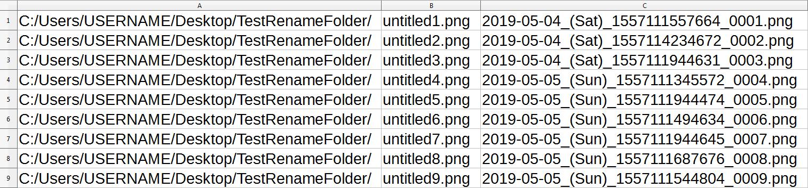
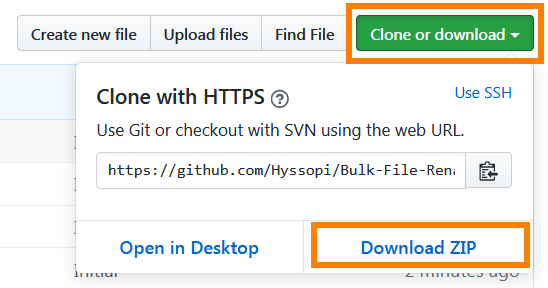

# Bulk-File-Renamer
Bulk file renaming program.

## Prerequisites
- `Node.js` installed

## Build
(None)

## Run
1. Install Node.js

2. Download this repository as a zip file to your local PC. Then extract the contents.

    

3. Open command prompt/terminal.

4. Change directory to your `Bulk-File-Renamer` folder location via `cd`.

5. Run `node main.js "C:/Users/USERNAME/Desktop/TestRenameFolder"`. Change "`C:/Users/USERNAME/Desktop/TestRenameFolder`" to the folder path of the files you want to bulk rename.  
Recommended equivalent shortcut: `node main.js "%USERPROFILE%/Desktop/TestRenameFolder/"`.  
This will generate a `renameList.csv` file in the main project `Bulk-File-Renamer` folder.

6. Open `renameList.csv` located in the main project `Bulk-File-Renamer` folder.  
a. The **first** column is the directory path of the file.  
b. The **second** column is the *before* file name to rename.  
c. The **third** column is the *after* new file name that you want to rename to.   
Modify the third/right column and save changes.  
Recommended to use a spreadsheet application and open with separated by `tab` options.

    

7. When `renameList.csv` is ready, run `node main.js continue` to start renaming the files listed in the `renameList.csv`.

8. The renaming program should rename the files based on the `renameList.csv` file.

9. The output log `renameList.log` is written to the main project `Bulk-File-Renamer` folder.

## Test
(None)
